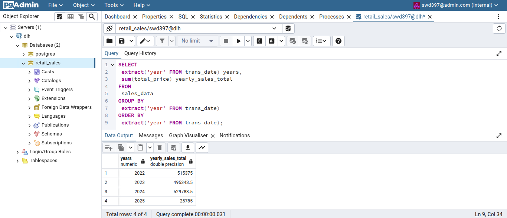
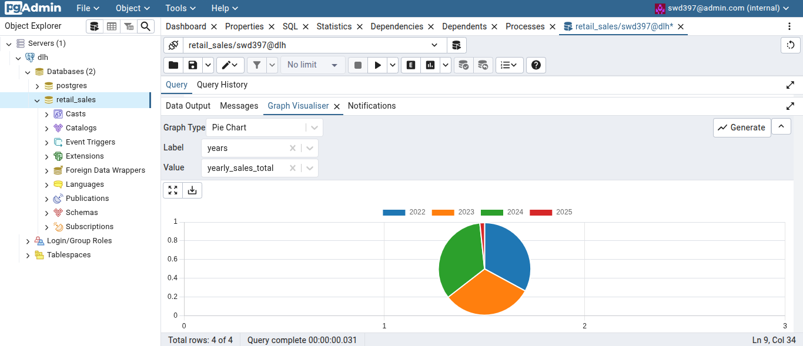
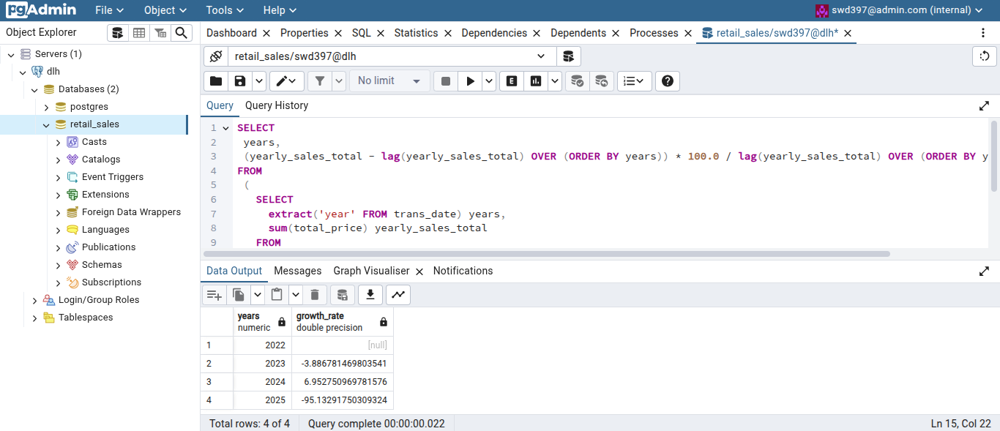
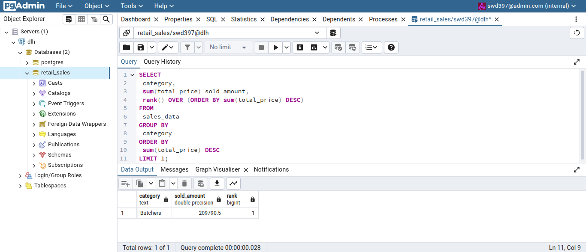
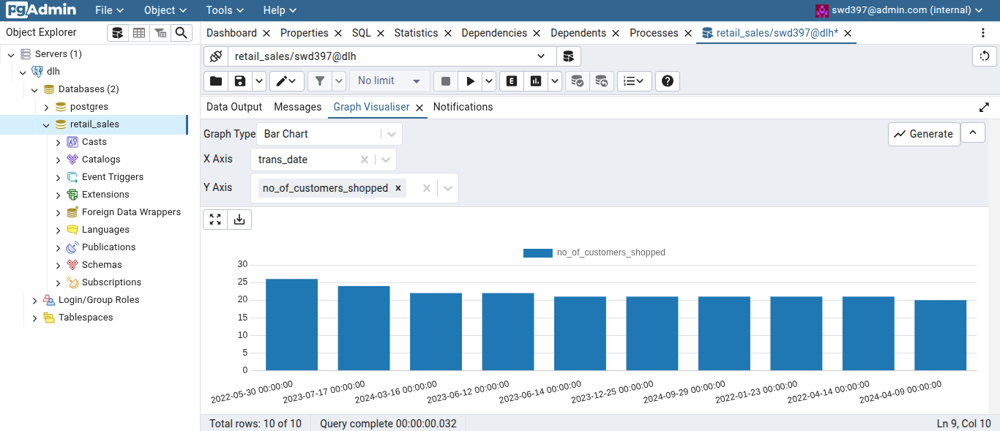
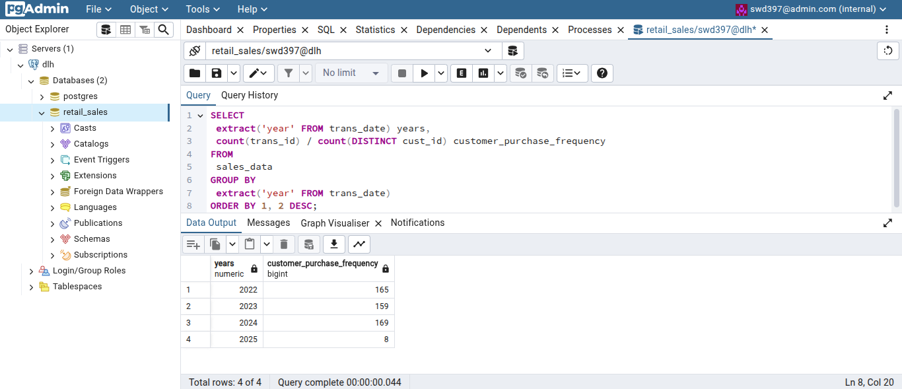

## Detailed explanation of the project along with replication steps

### Creation of Postgres and PgAdmin docker containers 
 1. Create a docker compose file to run the services, postgres and pgadmin. The docker compose file automatically downloads the docker images and runs multiple containers in a single network. 
	
 docker-compose.yaml:
 ```yaml
services:
 retaildb:
  image: postgres:18
  environment:
   POSTGRES_USER: ${POSTGRES_USER}
   POSTGRES_PASSWORD: ${POSTGRES_PASSWORD}
   POSTGRES_DB: ${POSTGRES_DB}
  volumes:
   - ./retail_sales_data:/var/lib/postgresql 
  ports:
   - ${POSTGRES_PORT}:5432
 
 pgadmin:
  image: dpage/pgadmin4
  environment:
   PGADMIN_DEFAULT_EMAIL: ${PGADMIN_DEFAULT_EMAIL}
   PGADMIN_DEFAULT_PASSWORD: ${PGADMIN_DEFAULT_PASSWORD}
  ports:
   - ${PGADMIN_PORT}:80
 ```

 **Docker compose explanation:**
 * The `services` key contains the names of the postgres and pgadmin containers, retaildb and pgadmin respectively.
 * The `image` refers to the docker images that the docker containers would be created from. Here, the postgres version 18 and the latest version of PgAdmin would be downloaded when run.
 * Environment variables required for accessing postgres db and pgadmin are acquired from `.env` file.
 * `Volumes` refers to the local directory that the container path would be mounted onto. This would help prevent loss of data after exiting from the postgres container. The pgadmin volume has not been mounted to local directory and so the servers for postgres had to be added manually everytime the containers are run.
 * `Ports` refers to the port number of the postgres and pgadmin services.
	
 2. Store the database and pgadmin credentials in the `.env` file and place it in the same place as the docker-compose.yaml file.
 3. Replace the below values between << and >> with your personal db and pgadmin credentials.
	
 .env:
 ```.env
 POSTGRES_DB=<<db_name>>
 POSTGRES_USER=<<postgres_user>>
 POSTGRES_PASSWORD=<<postgres_password>>
 POSTGRES_PORT=<<postgres_port_number>>

 PGADMIN_DEFAULT_EMAIL=<<pgadmin_email>>
 PGADMIN_DEFAULT_PASSWORD=<<pgadmin_password>>
 PGADMIN_PORT=<<pgadmin_port_number>>
 ```
 4. Run docker compose to start the containers, postgres and pgadmin.
 ```bash
 docker compose up -d
 ```
 5. Go to the web browser and type, localhost:<<pgadmin_port_number>>
 6. The pgadmin webpage opens, enter the pgadmin's username and password as mentioned in the .env file and login.
 7. After logging in, click on 'Add New Server'. 
 8. Under the `General` tab, provide a server name. 
 9. On the `Connection` tab, enter the postgres service name as Host name/address postgres, then the postgres db credentials and click Save.
 10. On the left side of the screen, the added server and databases can be accessed.
 11. Stop the docker compose after completion with the below prompt. It also deletes the containers and the docker network.
 ```bash
 docker compose down
 ```
 
### Creation of Python script, its docker container, connecting to postgres and transferring data
 1. A python script to transfer csv data to database has to be created and dockerized.
 2. A Dockerfile is created to write a custom python app image which would then be added to the docker compose to build the image and add it to the docker network.
 
 Dockerfile:
 ```dockerfile
 FROM python:3.9
 
 WORKDIR /app

 COPY insert_retail_data_csv.py .
 COPY requirements.txt .
 COPY retail_store_sales.csv .

 RUN pip install --no-cache-dir -r requirements.txt

 ENTRYPOINT ["python","insert_retail_data_csv.py"]
 ```
 requirements.txt:
 ```requirements.txt
pandas
sqlalchemy
psycopg2
 ```
 
 **Dockerfile Explanation:**
 * From instruction refers to the docker image that the Dockerfile should use. Here, it refers to the python version 3.9.
 * The workdir instruction sets the working directory to app instead of the root folder in the docker container.
 * Copy instruction copies the files from source/host directory on which the Dockerfile is located to the docker container's working directory. Here, the python script to dockerize, the import libraries required for the python script and the data file is copied to the container's app directory.
 * Run instruction installs required libraries or toolkits mentioned in the requirements file using pip in python.
 * Entrypoint instruction executes the python script with respect to the arguments.
 * Requirements file consists of the installations required for pandas, sqlalchemy and psycopg2. The latter two are used for connecting python to the postgres db. 
 
 3. Add the Dockerfile image build instruction to the existing docker-compose.yaml file.
 
 docker-compose.yaml:
 ```yaml
 py_insertion_app:
    build:
      context: .
      dockerfile: Dockerfile
    depends_on:
      - retaildb # To run only after the postgres service is run
    environment:
      DB_HOST: ${HOST} # Use the postgres service name as the hostname
      DB_NAME: ${POSTGRES_DB}
      DB_USER: ${POSTGRES_USER}
      DB_PASSWORD: ${POSTGRES_PASSWORD} 
      DB_PORT: ${POSTGRES_PORT} 
 ```
 4. Add the host value in the .env file.
 
 .env:
 ```ini
 HOST=<<postgres_service_name>>
 ```
 
 **Docker compose modification explanation:**
  * py_insertion_app is set as the custom docker image.
  * Build key refers that the image has to be built from a Dockerfile.
  * Context refers to the files and directories sent to the docker daemon from the current working directory (.) during build.
  * Dockerfile refers to the Dockerfile present in the same directory that provides the instructions to build the image.
  * Depends_on makes sure the postgres service runs before the python docker container.
  * Environment acquires the environment variables from the .env file.
 
 insert_retail_data_csv.py:
 ```python
import os # to get parameters from Docker compose file's environment variables
import pandas as pd # to read the csv and 
from sqlalchemy import create_engine # to connect to postgres database for data transfer
from time import time # to calculate the time taken for insertion

if __name__ == '__main__':
	 
	host = os.getenv('DB_HOST')
	user = os.getenv('DB_USER')
	password = os.getenv('DB_PASSWORD')
	port = int(os.getenv('DB_PORT'))
	db = os.getenv('DB_NAME')
	table_name = 'sales_data'
	
	engine = create_engine(f'postgresql://{user}:{password}@{host}:{port}/{db}') 
	print('DB connected successfully..trying to insert data')
	try:
		df = pd.read_csv('retail_store_sales.csv') 
		new_column_names = ['trans_id', 'cust_id', 'category', 'item_code', 'price_per_unit', 'quantity', 'total_price', 'pay_type', 'location', 'trans_date', 'discount_applied']
		df.columns = new_column_names 
		df.trans_date = pd.to_datetime(df.trans_date) 
		df.head(n=0).to_sql(name = table_name, con = engine, if_exists = 'replace') #df.head(n=0) takes only the column names and so this code helps in creating a new table in the db with just the table structure
		t_start = time()
		df.to_sql(name = table_name, con = engine, if_exists = 'append') 
		t_end = time()
		print('Data insertion completed in %.3f seconds\nSuccess!' % (t_end-t_start))	
	except:
		print('Something went wrong! Try again :(') 	
 ```
 **Python Script Explanation:**
 * Import os, pandas, sqlalchemy to python script. They have already been installed via pip using the requirements file.
 * Get the environment variables acquired from docker compose using os.getenv() function.
 * Create a database connection using create_engine function of SQLAlchemy.
 * Read the csv file using pandas' read_csv function and store it in a dataframe.
 * The dataset's column names had spaces and needed to be updated for db column name compatibility. Change the column names in the dataframe.
 * Update the datatype of the date column in the dataset to make it a date column instead of plain text while creating the table in the database using to_sql() method.
 * Create the table with column names from the csv file using head().to_sql() method. The name of the table, the db connection and the option to replace the table are provided as arguments in the to_sql() method.
 * To know the time taken for inserting the data into the database, the time() function is used.
 * Finally, the data from the pandas dataframe is inserted into the table with to_sql() method.
 * All the above code are encapsulated in try..except blocks to avoid runtime errors.

 5. After all the above setup, make sure to add the csv file in the same directory as above files.
 6. Build the docker container for python app and run it.
 
 ```bash
 docker compose up --build -d
 ```
 7. Check all the containers using,
 ```bash
 docker ps -a
 ```
 8. Find the docker container id of the python script. To check the python script's execution or output, go to docker logs.
 ```bash
 docker logs <<python_container_id>>
 ```
 9. If the output shows success, the csv data has been successfully transferred to the database.
 
### Data Cleaning
 1. Go to the database in PgAdmin where the table is stored. Check the presence of the table and its contents using the Query tool. 
 ```sql
 select * from sales_data;
 ```
 2. Before data exploration, identify and update the missing values in the dataset's columns, item_code, price_per_unit, quantity and total_price.
 3. On observation of the table data, identified that the missing item_code values can be updated with price_per_unit value or deducing the values in columns quantity and total_price.
 4. This would require creation of temporary tables to store category wise item_code and price values. Joining the temp table and sales_data table values, the missing values could be updated and data consistency can be achieved.
 5. All the temp tables are to be updated with same columns. Therefore, created a stored procedure to dynamically create and insert values into the temp tables.
 
 sp_create_populate_temp_tables.sql:
 ```sql
--Create stored procedure to dynamically create temporary tables to help update missing values in sales_data table

CREATE OR REPLACE PROCEDURE create_populate_temp_tables (tbl_name VARCHAR, categ_value VARCHAR) 
LANGUAGE plpgsql 
AS $$
BEGIN
    -- Use dynamic SQL to construct and execute the UPDATE statement.
    -- The source table name and the string value must be concatenated into the query string using %I and %L respectively.
    EXECUTE format('
    CREATE TEMP TABLE %I AS 
    SELECT 
    		item_code,
  			min(price_per_unit) AS price
		FROM
  			sales_data
		WHERE
  			category = %L
  		AND item_Code IS NOT NULL
		GROUP BY
  			item_code
		ORDER BY
  			item_code;;
    ', tbl_name, categ_value);
END;
$$;
 ```
 6. The stored procedure dynamically creates temporary tables from sales_data table and acquires temp table name and category value as parameters.
 7. Execute the stored procedure with the below call() function.
 
 run_sp_create_populate_temp_Tables.sql:
 ```sql
--Run the stored procedure, create_populate_temp_tables with the below values to create the temporary tables with required data

CALL create_populate_temp_tables('furniture', 'Furniture');
CALL create_populate_temp_tables('comp_elec_access', 'Computers and electric accessories');
CALL create_populate_temp_tables('food', 'Food');
CALL create_populate_temp_tables('elec_hous_essen', 'Electric household essentials');
CALL create_populate_temp_tables('milk_products', 'Milk Products');
CALL create_populate_temp_tables('butchers', 'Butchers');
CALL create_populate_temp_tables('patisserie', 'Patisserie');
CALL create_populate_temp_tables('beverages', 'Beverages');
 ```
 8. The updates in the sales_data table from various temp tables had to be carried using out multiple times. A dynamic stored procedure would help complete the update efficiently.
 
 sp_update_missing_values.sql:
 ```sql
--Create stored procedure to dynamically carry out the missing data updates and provide consistent data for analysis

CREATE OR REPLACE PROCEDURE update_missing_values (source_tbl_name VARCHAR, categ_value VARCHAR) 
LANGUAGE plpgsql 
AS $$
BEGIN
    -- Use dynamic SQL to construct and execute the UPDATE statement.
    -- The source table name and the string value must be concatenated into the query string using %I and %L respectively.
    EXECUTE format('
        UPDATE sales_data sd
        SET 
            item_code = t.item_code, 
			price_per_unit = t.price
        FROM 
            %I t
        WHERE 
			sd.item_code IS NULL 
		AND sd.category = %L 
		AND (sd.price_per_unit = t.price OR (sd.total_price/sd.quantity) = t.price);
    ', source_tbl_name, categ_value);

	EXECUTE format('
		UPDATE sales_data sd 
		SET 
            quantity = 1, 
		    total_price = t.price 
		FROM 
            %I t 
		WHERE 
            sd.category = %L 
		AND sd.item_code = t.item_Code
		AND sd.total_price IS NULL 
		AND sd.quantity IS NULL;
	', source_tbl_name, categ_value);
END;
$$;
 ```
 run_sp_update_missing_values.sql:
 ```sql
--Run the stored procedure, update_missing_values with the below values to ensure data consistency

CALL update_missing_values('furniture', 'Furniture');
CALL update_missing_values('comp_elec_access', 'Computers and electric accessories');
CALL update_missing_values('food', 'Food');
CALL update_missing_values('elec_hous_essen', 'Electric household essentials');
CALL update_missing_values('milk_products', 'Milk Products');
CALL update_missing_values('butchers', 'Butchers');
CALL update_missing_values('patisserie', 'Patisserie');
CALL update_missing_values('beverages', 'Beverages');
 ```
 9. Ensure Total Spent = Quantity * Price Per Unit where all three values are present for data consistency. If the below query returns zero rows, the data is consistent and fit for analysis or exploration.
 ```sql
 select * from sales_data where (price_per_unit * quantity) <> total_price;
 ```
#### Simple Exploratory Data Analysis
 
 1. Calculation of daily, monthly and yearly sales total
 ```sql
--Daily Sales total
SELECT
  trans_date date,
  sum(total_price) daily_sales_total
FROM
  sales_data
GROUP BY
  trans_date
ORDER BY
  trans_date;

--Monthly Sales total
SELECT
  date_trunc('month', trans_date) monthandyear,
  sum(total_price) monthly_sales_total
FROM
  sales_data
GROUP BY
  date_trunc('month', trans_date)
ORDER BY
  date_trunc('month', trans_date);

--Yearly Sales total
SELECT
  extract('year' FROM trans_date) years,
  sum(total_price) yearly_sales_total
FROM
  sales_data
GROUP BY
  extract('year' FROM trans_date) 
ORDER BY
  extract('year' FROM trans_date);
  ```
 
 
 
  2. Calculation of growth rate
 ```sql
SELECT
  years,
  (yearly_sales_total - lag(yearly_sales_total) OVER (ORDER BY years)) * 100.0 / lag(yearly_sales_total) OVER (ORDER BY years) growth_rate
FROM
  (
    SELECT
      extract('year' FROM trans_date) years,
      sum(total_price) yearly_sales_total
    FROM
      sales_data
    GROUP BY
      extract('year' FROM trans_date)
    ORDER BY
      extract('year' FROM trans_date)
  ) yearly_sales_data;
  ```
 
 
 3. Identify best-selling products and categores 
 ```sql
--Best Selling Product
SELECT
  item_code product,
  sum(total_price) sold_amount,
  rank() OVER (ORDER BY sum(total_price) DESC)
FROM
  sales_data
GROUP BY
  item_code
ORDER BY
  sum(total_price) DESC
LIMIT 1;

--Best Selling Category
SELECT
  category,
  sum(total_price) sold_amount,
  rank() OVER (ORDER BY sum(total_price) DESC)
FROM
  sales_data
GROUP BY
  category
ORDER BY
  sum(total_price) DESC
LIMIT 1;
 ```
 
 
 4. Identify peak shopping days
 ```sql
SELECT
  trans_date,
  count(cust_id) no_of_customers_shopped
FROM
  sales_data
GROUP BY
  trans_date
ORDER BY 2 DESC
LIMIT 10;
 ```
 
 
 5. Calculate customer purchase frequency
 ```sql
SELECT
  extract('year' FROM trans_date) years,
  count(trans_id) / count(DISTINCT cust_id) customer_purchase_frequency
FROM
  sales_data
GROUP BY
  extract('year' FROM trans_date)
ORDER BY 1, 2 DESC;
 ``` 
 
 
 To exit, logout from PgAdmin and exit all the docker containers with the below prompt.
 ```bash
 docker compose down
 ```
